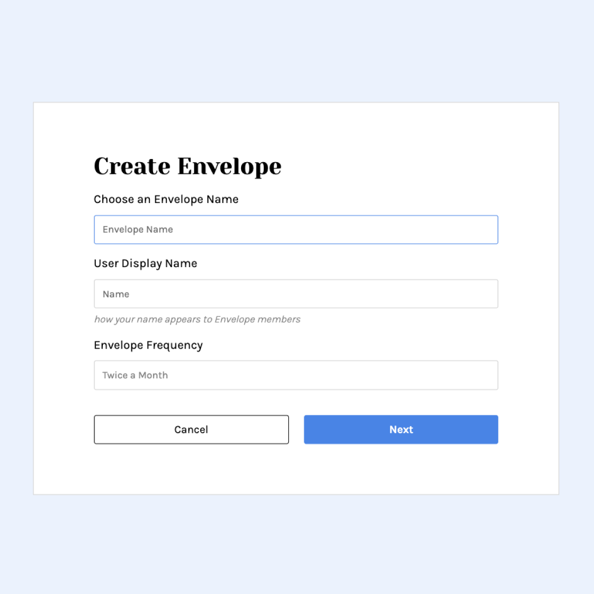
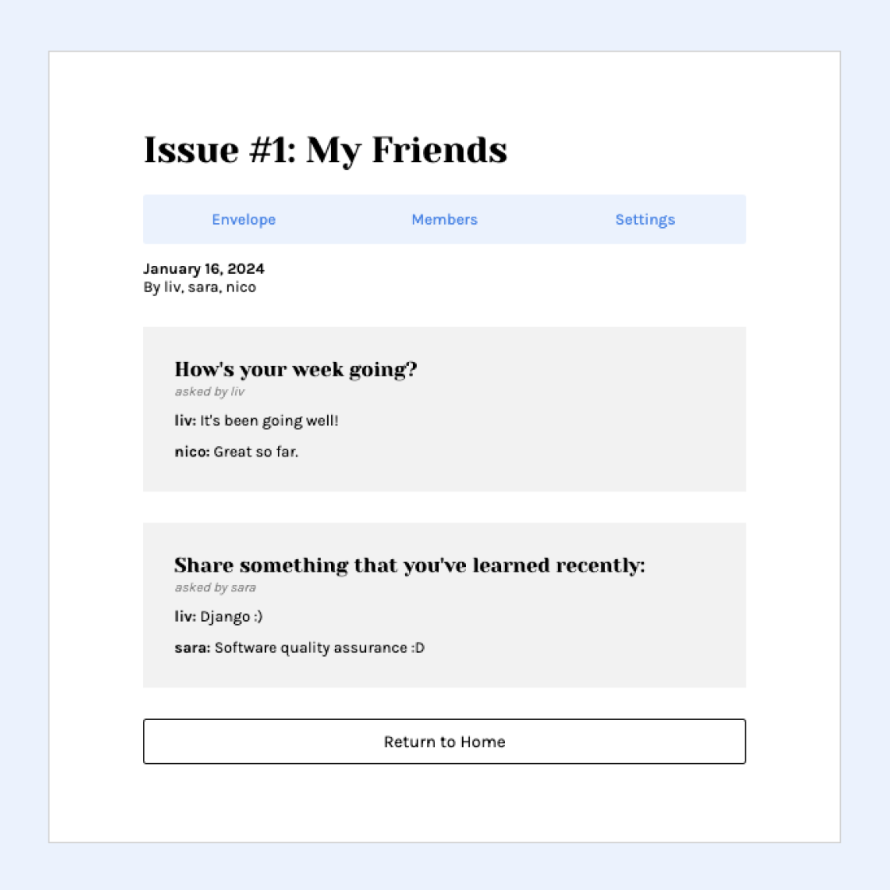

# Swell
## About the Project
Swell is a communication platform that allows users to connect with their friends and family. Users create groups known as *Envelopes,* which contain custom questions for members to fill out. Once completed, members will recieve a published version of the Envelope in their inbox!

Built with **Python** and **Django**.

<p float="left">
  
  
</p>

## As a user, you may...
- Register, login, and logout of the app
- Create Envelope groups with personalized questions
- Send custom invite links to friends via email
- Answer questions created by the admin/users
- Receive periodic emails containing Envelope updates with [Celery](https://docs.celeryq.dev/en/stable/userguide/periodic-tasks.html)

## Getting Started
Before you begin, ensure you have installed Python 3.8.0 or later.

### Installation
1. Clone the repository:
```
git clone https://github.com/livelliott/swell.git
```
2. Create a virtual environment:
```
python3 -m venv venv
```
3. Activate the virtual environment.
4. Install project dependencies:
```
pip3 install -r requirements.txt
```

### Installation
1. Create a copy of the example environment file:
```
cp .env.example .env
```
2. Modify the .env file to support your local configuration settings.

### Running the Project
1. Start the developement server:
```
python3 manage.py runserver
```
2. Visit [http://localhost:8000/](http://localhost:8000/) on your browser to access the application.


*This project is inspired by the web app [LetterLoop](https://app.letterloop.co/).*